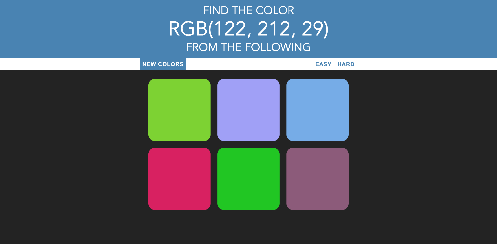
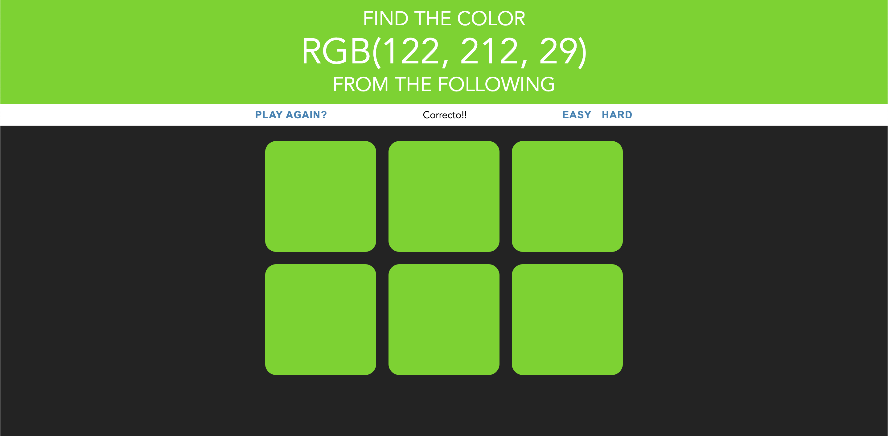

<h1 align="center"> Color Guessing Game </h1>

This game was developed with the intent of using simple Vanilla JavaScript and CSS to work directly with the Document Object Model. There are 2 levels to this game - easy and hard. The player has to guess what color correlates to the RGB color combination that's shown on the top of the screen. 

Player can choose to give up and get new colors, or choose to play again after they've achieved a win.

• The game starts out with 3 or 6 different colors to choose from

• When the correct color is chosen, the all other boxes and banner will transition to the winning color!

